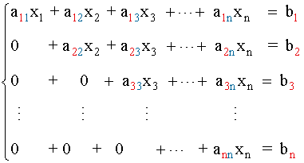
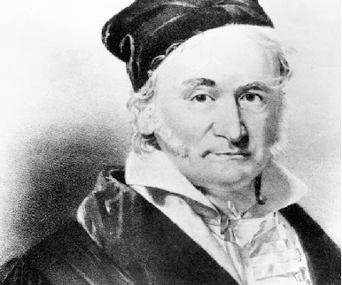

# Gauss Method in Octave

Different scripts to solve various problems by applying the Gauss method




## Index
1. [Introduction](#introduction)
1. [Gauss Method](#gauss-method)
3. [Simple Gauss method](#simple-gauss-method)
4. [Gauss method with column pivoting](#gauss-method-with-column-pivoting)
    1. [Maximal pivoting by columns](#maximal-pivoting-by-columns)
5. [Gauss method with maximal pivoting (rows and columns)](#gauss-method-with-maximal-pivoting-rows-and-columns)


## Introduction

In the linear algebra course of computer engineering, we were asked to create different scripts in Octave, with the purpose of finding the various unknowns by applying the Gauss method.

For each script it will be required to fulfill a main objective.


## Gauss Method



The Gauss method, also known as Gaussian elimination, is a procedure for solving systems of linear equations. It consists of transforming the system into a simpler form, usually in row echelon form, by means of elementary operations on the rows of the associated matrix.

### Main steps of the Gauss method
1. **Formation of the augmented matrix**: The coefficient matrix is ​​combined with the vector of independent terms in an augmented matrix.

2. **Elimination**: Row operations (swapping rows, multiplying rows by a scalar, adding or subtracting rows) are performed to create zeros below the main diagonal. This transforms the matrix into an upper triangular form.

3. **Back substitution**: Once the triangular form is obtained, the system is solved starting from the last equation to the first, thus finding the values ​​of the variables.

This method is fundamental in linear algebra and is used in various applications, such as solving differential equations, optimization, and more.


## Simple Gauss method
The first script consists of applying the Gauss method on a given matrix and its results.
For example:

A= [3,2,1;2,3,1;1,3,2]
B = [3;2;1]

Remember that the Gauss method must convert the matrix to an upper triangular matrix, that is, in order to find the value of each unknown, you will have to apply a series of operations to convert the matrix into a pyramid of "0".

For example:

``` 
|  2   -3  1  |  7 |            |  1    2  -1  | -3 |
|  1   2  -1  | -3 |     ->     |  0   -7   3  | 13 |
| -3   1   2  |  0 |            |  0    0   2  |  4 |
```


## Gauss method with column pivoting
The second script is very similar to the first script (it must comply with the Gauss method), but we implement the rule of maximal pivoting by columns.

### Maximal pivoting by columns
When we talk about maximal pivoting by columns, we refer to finding the largest number that can be found in a column.
This allows us to modify the order of a matrix, making the Gauss method easier. It should be noted that when the order of the columns of a matrix is modified, it must be taken into account when giving the result, since the order of the unknowns will have been altered.

For example:

``` 
|  2  -3   1  |  7 |            | -3   2   1  |  7 |
|  1   2  -1  | -3 |     ->     |  2   1  -1  | -3 |
| -3   1   2  |  0 |            |  1  -3   2  |  0 |
```


## Gauss method with maximal pivoting (rows and columns)
Last but not least, we need to create a script which will apply the Gauss method. But it has the difficulty that before applying the Gauss method, it will have to sort the largest numbers by rows and ends.

For example:

``` 
|  2  -3   1  |  7 |            | -3   2   1  |  7 |
|  1   2  -1  | -3 |     ->     |  2   1  -1  | -3 |
| -3   1   2  |  0 |            |  1  -3   2  |  0 |
```


***Some words or notes are taken from the lessons taught in engineering**